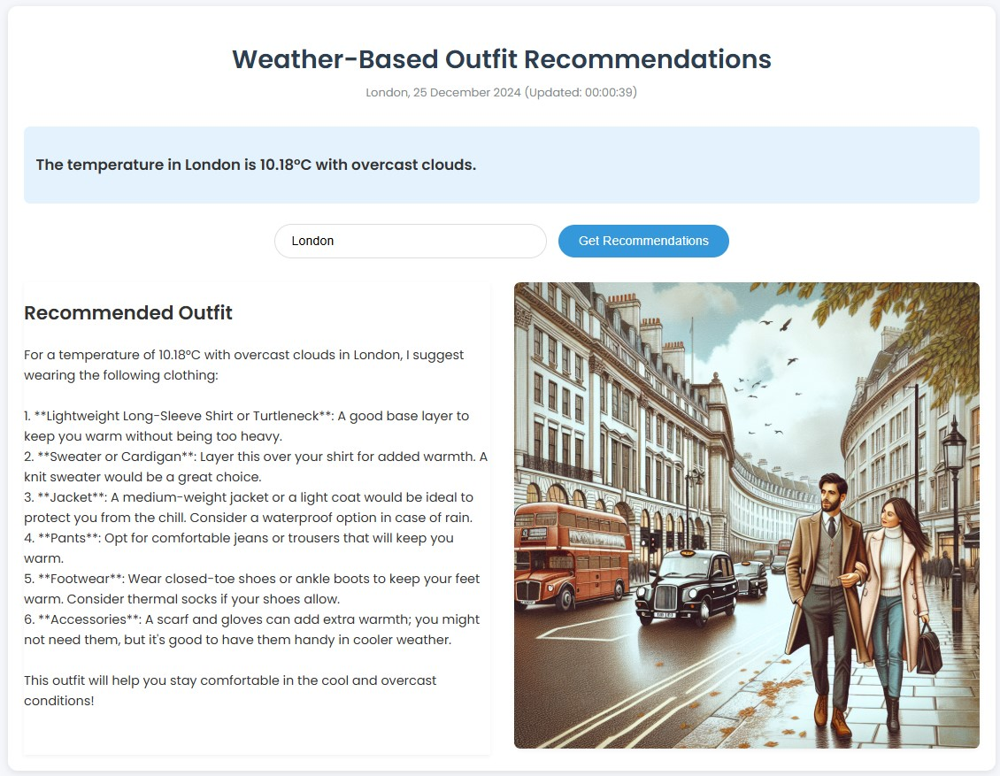

# Weather and Clothing Advisor Application

## Overview
The Weather and Clothing Advisor Application is a Flask-based web application that provides users with weather information and personalized clothing recommendations based on the current weather conditions in their city. Users can input their city, and the application will fetch the relevant weather data, suggest appropriate clothing, and generate a visual representation of the weather.

## Features
- **Weather Information**: Retrieves real-time weather data for the specified city.
- **Clothing Recommendations**: Suggests clothing items based on the current weather conditions.
- **Image Visualization**: Generates a visual representation of the weather for better user understanding.
- **User-Friendly Interface**: Simple and intuitive web interface for easy interaction.
- **Dynamic Updates**: Updates recommendations and visuals based on user input.

## Tech Stack
- **Flask**: A lightweight WSGI web application framework for Python.
- **Python**: The programming language used for backend development.
- **WeatherAgent**: A custom agent for fetching weather data.
- **ClothingAdvisorAgent**: A custom agent for providing clothing recommendations.
- **VisualizationAgent**: A custom agent for generating weather-related images.
- **HTML/CSS**: For front-end rendering and styling.

## How to Run/Use the Project
1. **Clone the Repository**:
   ```bash
   git clone <repository-url>
   cd <repository-directory>
   ```

2. **Create and Activate a Conda Environment**:
   ```bash
   conda create --name weather-advisor
   conda activate weather-advisor
   ```

3. **Install Dependencies**:
   Install the required packages:
   ```bash
   pip install -r requirements.txt
   ```

4. **Run the Application**:
   Start the Flask application:
   ```bash
   python main.py
   ```

5. **Access the Application**:
   Open your web browser and go to `http://127.0.0.1:5000/` to access the application.

6. **Input Your City**:
   Enter the name of your city in the provided input field and submit to receive weather information and clothing recommendations.

## Application Screenshot
  # or  if in a folder

## License
This project is licensed under the MIT License - see the [LICENSE](LICENSE) file for details.
